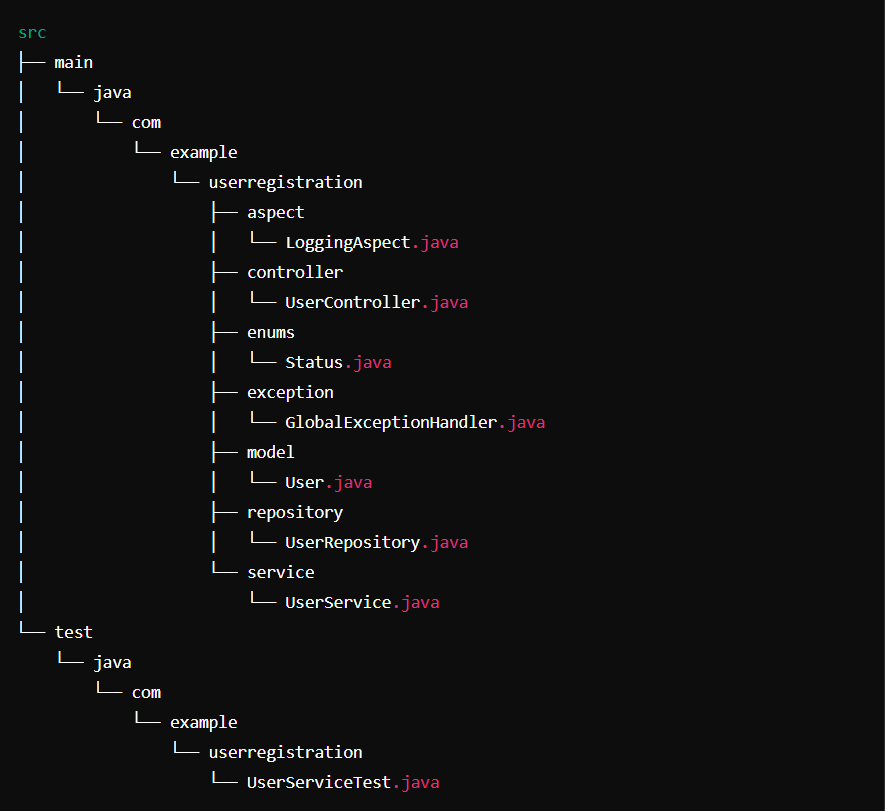

# User Registration System
User Registration System is a simple application for managing user registration built with Spring Boot.

## architecture of project


## Features

- Register new users with their basic information.
- Retrieve user details by ID.
- Retrieve users by status.
- Handle validation errors gracefully.

## Technologies Used

- Java 17
- Spring Boot 2.6.7
- MongoDB (you nedd to install MongoDB Compass)
- Maven 

## Getting Started

To get started with the User Registration System, follow these steps:

1. **Clone the repository:**

   ```bash
   git clone https://github.com/tamedi/air-france.git
